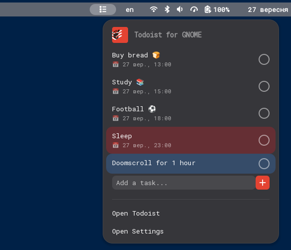
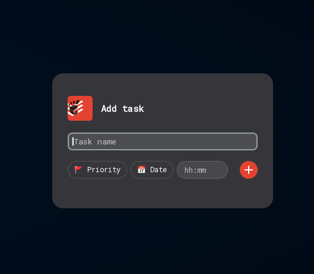

<div align="center">


# Todoist for GNOME

**Your Todoist tasks, right in the top panel.**

[](https://extensions.gnome.org/)
[](LICENSE)
[](https://extensions.gnome.org/)

</div>

---

## What it does

**Todoist for GNOME** adds a Todoist dropdown to your top panel, so you can check and manage your tasks without opening a browser tab or the desktop app.

- 📋 **See your tasks at a glance** — a panel dropdown lists your tasks, sorted by due date and priority, with color-coded priority tags (P1–P4), just like in Todoist itself.
- ✅ **Complete tasks in one click** — a round check button on each row, with a small completion animation.
- ➕ **Quick-add** — a text field right in the dropdown for adding a task in a couple of keystrokes.
- ⌨️ **Add a task from anywhere** — a global keyboard shortcut opens a small "Add task" popup on top of whatever you're doing.
- ✍️ **Type naturally** — the quick-add field and the Add Task popup both understand inline shortcuts: `!!1`…`!!4` for priority, `25.12.2026` for a due date, `14:30` for a time — or just pick them with the priority / date / time buttons.
- 🔗 **Open in Todoist** — click any task to jump straight to it in the Todoist desktop app (native, Flatpak or Snap) or the web app as a fallback.

## Screenshots

<div align="center">

| Panel dropdown | Add task popup |
|:---:|:---:|
|  |  |

</div>

## Installation

### From GNOME Extensions (recommended)

Once published, you'll be able to install it directly from your browser:

[**extensions.gnome.org/extension/XXXX/todoist-for-gnome**](https://extensions.gnome.org/) *(link coming soon)*

### Manually, from source

```bash
git clone https://github.com/cheapdramas/todoist-for-gnome.git
cd todoist-for-gnome

# Copy the extension into GNOME Shell's extensions folder
mkdir -p ~/.local/share/gnome-shell/extensions/todoist-for-gnome@cheapdramas.github.io
cp -r * ~/.local/share/gnome-shell/extensions/todoist-for-gnome@cheapdramas.github.io/

# Compile the settings schema
glib-compile-schemas ~/.local/share/gnome-shell/extensions/todoist-for-gnome@cheapdramas.github.io/schemas/

# Enable the extension
gnome-extensions enable todoist-for-gnome@cheapdramas.github.io
```

Then restart GNOME Shell so it picks up the new extension:
- **X11**: press <kbd>Alt</kbd>+<kbd>F2</kbd>, type `r`, press Enter.
- **Wayland**: log out and log back in.

## Setup

### 1. Get your Todoist API token

1. Open Todoist in your browser and go to **Settings → Integrations → Developer**.
2. Copy the **API token** shown there.

### 2. Add it to the extension

1. Open **GNOME Extensions** (or run `gnome-extensions prefs todoist-for-gnome@cheapdramas.github.io`).
2. Find **Todoist for GNOME** and open its settings.
3. Paste the token into the **API Token** field.

### 3. (Optional) Pick your Todoist app

In the same settings window, click **Choose...** next to **Todoist Application** and select the Todoist `.desktop` file (native, Flatpak or Snap) — this is what opens when you click on a task. If you skip this, tasks open in your browser instead.

### 4. (Optional) Set a keyboard shortcut

Still in settings, click **Change...** next to **Add Task** and press the key combination you want to use to open the quick "Add task" popup from anywhere.

## Contributing

Issues and pull requests are welcome. If you run into a bug or have an idea for a feature, please open an issue.

## License

[MIT](LICENSE)
